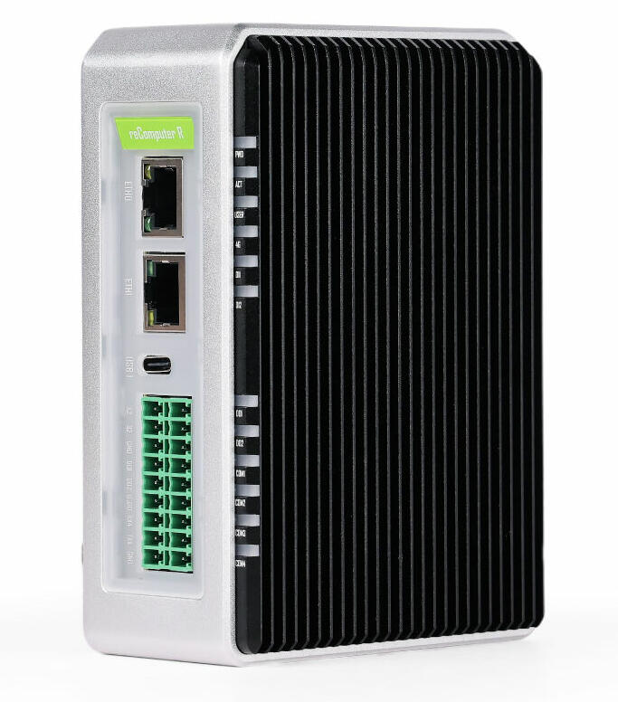

# Nerves System for reComputer R11xx (64-bit)

[](https://circleci.com/gh/nerves-project/nerves_system_rpi4)
[](https://hex.pm/packages/nerves_system_rpi4)

This is the base Nerves System configuration for the reComputer R11xx, a versatile edge IoT gateway with AI capabilities powered by the Raspberry Pi CM4.


<br><sup>[Seeed Studio / reComputer R11xx base ](https://www.seeedstudio.com/reComputer-R1113-10-p-6258.html)</sup>

## Hardware Features

| Feature              | Description                     |
| -------------------- | ------------------------------- |
| CPU                  | Broadcom BCM2711 quad-core Cortex-A72 (ARM v8) 64-bit SoC @ 1.5GHz |
| Memory               | Up to 8GB RAM                   |
| Storage             | Up to 32GB eMMC, MicroSD card slot, M.2 NVMe SSD slot (2280-M Key) |
| Linux kernel        | 6.1 w/ Raspberry Pi patches     |
| IEx terminal        | HDMI and USB keyboard (can be disable) |
| Ethernet            | 1x 10/100/1000Mbps (supports PoE*), 1x 10/100Mbps |
| Serial              | 2x RS485 (isolated), 2x RS232 (isolated) |
| Digital I/O         | 2x isolated DI ports (5~24V DC), 2x isolated DO ports (<60V DC) |
| USB                 | 2x Type-A USB 2.0, 1x Type-C USB 2.0 (for OS updates) |
| Display             | 1x HDMI 2.0                     |
| Wireless           | On-chip Wi-Fi/BLE |
| RTC                | PCF8563 Real-Time Clock with battery backup |
| Security           | Encryption Chips: |
|                    | - ATECC608A Crypto Authentication |
|                    | - TPM 2.0 (TPM SLB9670) (Currently not supported) |
| Power Input        | DC 9V~36V, PoE (IEEE 802.3af) support* |
| Mounting           | DIN-rail and wall mounting compatible |
| Expansion          | 2x Mini-PCIe slots supporting: (Currently not supported)   |
|                    | - Slot 1: 4G, USB LoRa®, USB Zigbee |
|                    | - Slot 2: SPI LoRa®, USB LoRa®, USB Zigbee |

*PoE module needs to be installed separately

## Industrial Features

- Hardware watchdog
- Optional UPS supercapacitor
- Durable metal casing with PC side panels
- EMC Standards:
  - ESD: EN61000-4-2, Level 3
  - EFT: EN61000-4-4, Level 2
  - Surge Protection: EN61000-4-5, Level 2
- Production lifetime until at least December 2030

## Using

To use this Nerves System in your project, you need to add it as a dependency in your `mix.exs` file:

```elixir
def deps do
  [
    {:nerves_system_recomputer_r11xx, github: "alde/nerves_system_recomputer_r11xx", runtime: false, targets: :recomputer_r11xx}
  ]
end
```

Then, set your `MIX_TARGET=recomputer_r11xx` when building the firmware. See the [Getting started
guide](https://hexdocs.pm/nerves/getting-started.html#creating-a-new-nerves-app)
for more information.

If you need custom modifications to this system for your device, clone this
repository and update as described in [Making custom
systems](https://hexdocs.pm/nerves/customizing-systems.html).

## Supported WiFi devices

The base image includes drivers for the onboard Wi-Fi module on R1100-10 models
(`brcmfmac` driver). For other models, wireless connectivity can be added through
the Mini-PCIe slots.

## Ethernet Support

The system includes two Ethernet ports:
- eth0: 10/100/1000Mbps Ethernet port with PoE capability (can use PoE module)
- eth1: 10/100Mbps Ethernet port enabled through the SMSC95XX USB driver (CONFIG_USB_NET_SMSC95XX)

Both ports are configured for automatic link detection and speed negotiation by default.
The secondary Ethernet port (eth1) is implemented using the USB SMSC95XX chipset, which
is enabled in the kernel configuration.

## GPIO Support

The reComputer R11xx provides access to the following isolated digital I/O pins:

| Hardware Label | GPIO Pin | Function |
|----------------|----------|----------|
| DI1            | GPIO18   | Digital Input (isolated, 5~24V DC) |
| DI2            | GPIO19   | Digital Input (isolated, 5~24V DC) |
| DO1            | GPIO20   | Digital Output (isolated, <60V DC) |
| DO2            | GPIO21   | Digital Output (isolated, <60V DC) |

The system includes a PCA953X GPIO extender that is already enabled in the Linux kernel.

The onboard user LED (USR_LED) is exposed through the Linux LED subsystem and can be 
controlled via the `/sys/class/leds` directory.

## Serial Support

The system includes four isolated serial ports implemented using the USB CDC ACM driver:
- 2x RS485 ports:
  - `/dev/ttyACM0`: RS485-1
  - `/dev/ttyACM1`: RS485-2
- 2x RS232 ports:
  - `/dev/ttyACM2`: RS232-1
  - `/dev/ttyACM3`: RS232-2

All serial ports are electrically isolated. The serial ports are implemented using the Linux `cdc_acm` driver, which provides standard
serial port functionality through the USB interface.

## Important Notes

- 4G and LoRa® modules cannot be used simultaneously
- Only one LoRa® module can be installed at a time
- PoE functionality requires separate module installation
- SSD compatibility may vary; maximum speeds:
  - Write: ~230MB/s
  - Read: ~370MB/s

## Provisioning devices

This system supports storing provisioning information in a small key-value store
outside of any filesystem. Provisioning is an optional step and reasonable
defaults are provided if this is missing.

Provisioning information can be queried using the Nerves.Runtime KV store's
[`Nerves.Runtime.KV.get/1`](https://hexdocs.pm/nerves_runtime/Nerves.Runtime.KV.html#get/1)
function.

Keys used by this system are:

Key                    | Example Value     | Description
:--------------------- | :---------------- | :----------
`nerves_serial_number` | `"12345678"`      | By default, this string is used to create unique hostnames and Erlang node names. If unset, it defaults to part of the Raspberry Pi's device ID.

The normal procedure would be to set these keys once in manufacturing or before
deployment and then leave them alone.

For example, to provision a serial number on a running device, run the following
and reboot:

```elixir
iex> cmd("fw_setenv nerves_serial_number 12345678")
```

This system supports setting the serial number offline. To do this, set the
`NERVES_SERIAL_NUMBER` environment variable when burning the firmware. If you're
programming MicroSD cards using `fwup`, the commandline is:

```sh
sudo NERVES_SERIAL_NUMBER=12345678 fwup path_to_firmware.fw
```

Serial numbers are stored on the MicroSD card so if the MicroSD card is
replaced, the serial number will need to be reprogrammed. The numbers are stored
in a U-boot environment block. This is a special region that is separate from
the application partition so reformatting the application partition will not
lose the serial number or any other data stored in this block.

Additional key value pairs can be provisioned by overriding the default
provisioning.conf file location by setting the environment variable
`NERVES_PROVISIONING=/path/to/provisioning.conf`. The default provisioning.conf
will set the `nerves_serial_number`, if you override the location to this file,
you will be responsible for setting this yourself.

## Linux kernel and RPi firmware/userland

There's a subtle coupling between the `nerves_system_br` version and the Linux
kernel version used here. `nerves_system_br` provides the versions of
`rpi-userland` and `rpi-firmware` that get installed. I prefer to match them to
the Linux kernel to avoid any issues. Unfortunately, none of these are tagged by
the Raspberry Pi Foundation so I either attempt to match what's in Raspbian or
take versions of the repositories that have similar commit times.

## Linux kernel configuration

The Linux kernel compiled for Nerves is a stripped down version of the default
Raspberry Pi Linux kernel. This is done to remove unnecessary features, select
some Nerves-specific features like F2FS and SquashFS support, and to save space.

## TODOs

- Implement drivers for 4G modules
- Enable support for LoRa® modules
- Configure interface for Zigbee modules
- Test TPM 2.0 (OPTIGA™ TPM SLB9670)
- Configure access to system EEPROM
- Add support for power management and UPS supercapacitor

